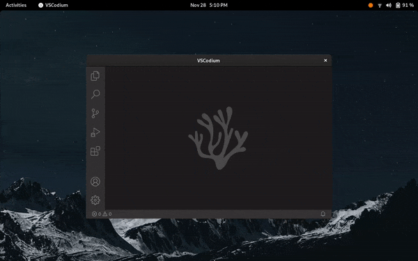

# No Titlebar When Maximized

[No Titlebar When Maximized](https://extensions.gnome.org/extension/4630/no-titlebar-when-maximized/) is a GNOME Shell extension to hide the classic title bar of maximized X.Org windows. It is a rewrite of [Pixel Saver](https://github.com/pixel-saver/pixel-saver) with a focus on simplification. In particular, it does *not* modify the core shell UI.

**It requires [the `xprop` command](https://command-not-found.com/xprop) to be installed in order to function.**

## Installation

1. Install [the `xprop` command](https://command-not-found.com/xprop).
2. Open [No Titlebar When Maximized](https://extensions.gnome.org/extension/4630/no-titlebar-when-maximized/) on the GNOME Shell Extentions website.
3. Toggle the slider to the "On" position.

## Development

For information on [creating](https://gjs.guide/extensions/development/creating.html) and [debugging](https://gjs.guide/extensions/development/debugging.html) a GNOME extension, see [the official documentation](https://gjs.guide/extensions).

Dependencies for this project are managed using [npm](https://www.npmjs.com/). To format the code, run `npm run format`. To lint the code, run `npm run lint`. To create a zip file suitable for [submission to GNOME](https://extensions.gnome.org/upload/) or [local installation](https://linuxconfig.org/how-to-install-gnome-shell-extensions-from-zip-file-using-command-line-on-ubuntu-18-04-bionic-beaver-linux), run `npm run build`.

## Contributing

Bug reports and pull requests are welcome on [GitHub](https://github.com/alecdotninja/no-titlebar-when-maximized).

## License

This extension is available as open source under the terms of [the GNU General Public License v2.0 or later
](https://spdx.org/licenses/GPL-2.0-or-later.html).
